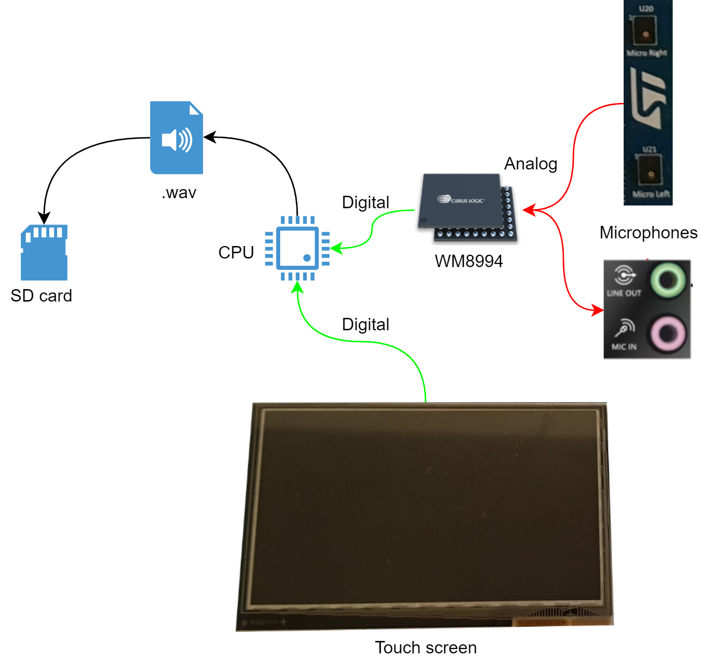

# Bienvenue sur le projet d'enregistreur vocal !

## Introduction
Paricipant à un TER sur de la reconnaissance vocale, la génération d'un modèle de reconnaissance vocale nécessite d'avoir un dictionnaire de mot et des enregistrements audio associés. Ce dictionnaire contient nottament des nom de cellules qui ne se trouvent pas dans les bases de données open-source. Ainsi, nous avons créé un script Matlab permettant d'enregistrer la voix de volontaires. Afin de permettre d'enregistrer un plus grand nombre de données, j'ai décidé de porter ce script sous forme d'application sur la carte STM32F746G.

Voici donc la nouvelle carte.

Ainsi que le schéma synoptique expliquant le fonctionnement du projet.

## Carte SD
### Problème lors de la migration en v1.16.1
création d'un nouveau projet de 0 avec les drivers du projet gitlab -> nul

migration + import settings de l'ancien -> nul

## Codec WM8994

## Interface tactile