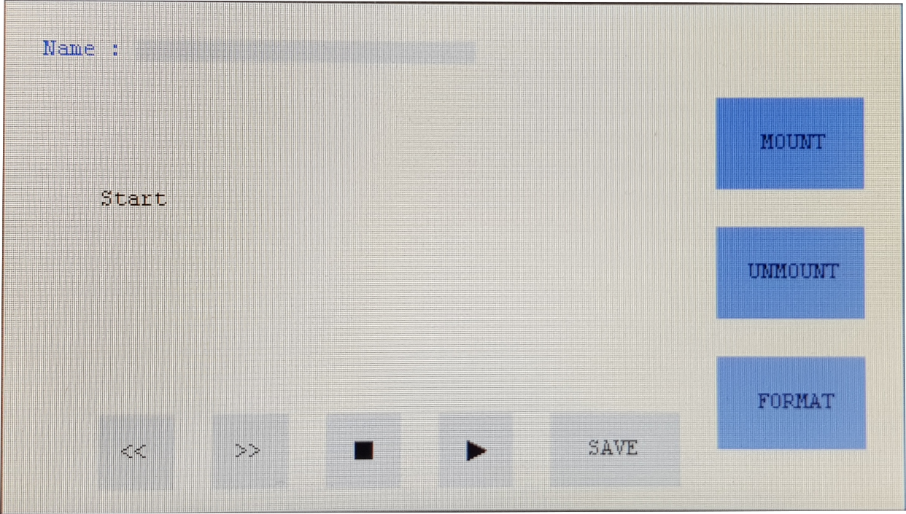
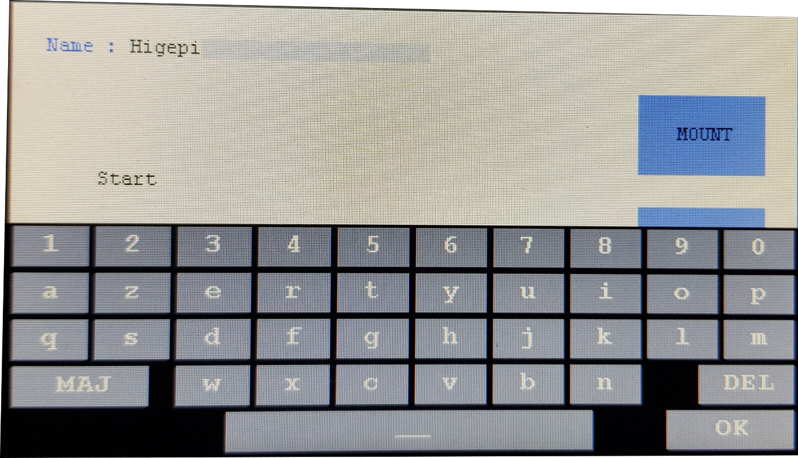

# Création de l'application

Il a fallu créer un environnement adapté à l'utilisateur, c'est-à-dire une interface graphique permettant d'utiliser l'application facilement.

On retrouve alors l'interface suivante,

*Carte STM32F746G-Discovery et son extension*

Où plusieurs boutons sont disponibles, ils permettent le changement de mot à enregistrer, l'enregistrement et l'écoute a-posteriori pour confirmer la prise de son et enfin des boutons de gestion de la carte SD à droite, dont seul le formatage fonctionne.

La zone de saisie de texte fait apparaître un clavier tactile permettant d'identifier l'utilisateur et ainsi de créer un répertoire à son nom. Ceci facilitera le traitement des données par la suite.

*Carte STM32F746G-Discovery et son extension*
