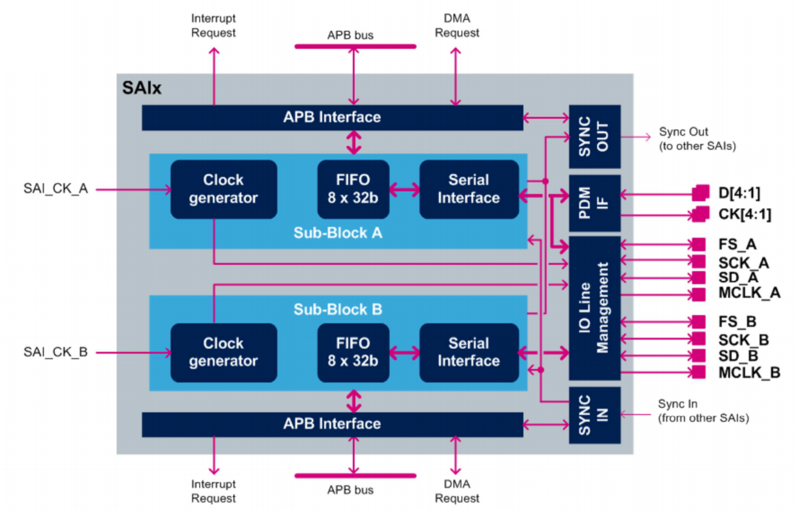
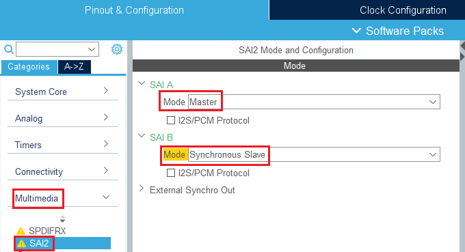
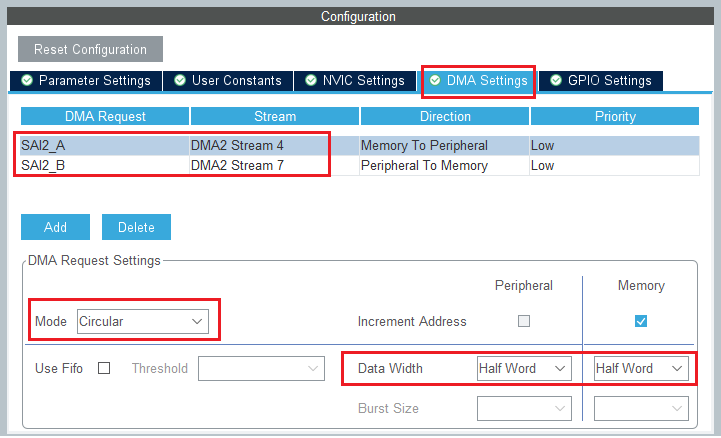

# Audio

Dans cette partie, nous verrons l'ajout de la bibliothèque pour l'utilisation du codec audio WM8994 ainsi que son utilisation.
La communication avec le codec se fera à l'aide de l'interface SAI.

## Documentation 

### Codec WM8994

Un Codec est un dispositif matériel permettant de mettre en oeuvre l'encode ou le décodage d'un flux de données numérique, en vue d'une transmission ou d'un stockage.


<center>*I/O Codec WM8994*</center>

Celui-ci présente 

[Lien doc WM8994](https://www.mouser.com/datasheet/2/76/WM8994_ProductBrief_2-217999.pdf)

### SAI


<center>*Diagramme SAI*</center>

[Lien doc SAI](https://www.st.com/resource/en/user_manual/dm00189702-description-of-stm32f7-hal-and-lowlayer-drivers-stmicroelectronics.pdf#page=861)

### DMA
[Lien doc DMA](https://www.st.com/content/ccc/resource/training/technical/product_training/group0/ce/9e/fe/44/e5/62/45/34/STM32F7_System_DMA/files/STM32F7_System_DMA.pdf/jcr:content/translations/en.STM32F7_System_DMA.pdf)
## Ajout de la bibliothèque

On active l'interface SAI dans Multimedia avec une liaison Maitre et une laison Esclave synchrone.

<center></center>

Les requêtes se font alors avec le DMA avec la configuration suivante



Une fois tout ceci fait, on peut rajouter les headers et fichiers sources dans notre projet.

## Fonctions principales
### Initialisations
#### Initialiser l'enregistrement
```txt
uint8_t BSP_AUDIO_IN_InitEx (
    uint16_t InputDevice    /* INPUT_DEVICE_DIGITAL_MICROPHONE_2 or INPUT_DEVICE_INPUT_LINE_1 */
    uint32_t AudioFreq,     /* Audio frequency to be configured for the SAI peripheral */
    uint32_t BitRes,        /* Audio frequency to be configured */
    uint32_t ChnlNbr        /* Channel number */
)
```

#### Initialiser le périphérique de sortie
```txt
uint8_t BSP_AUDIO_OUT_Init (
    uint16_t OutputDevice,  /* OUTPUT_DEVICE_SPEAKER, OUTPUT_DEVICE_HEADPHONE,
                            or OUTPUT_DEVICE_BOTH */
    uint8_t Volume,         /* Initial volume level (from 0 (Mute) to 100 (Max)) */
	uint32_t AudioFreq      /* Audio frequency used to play the audio stream */
    )
```

### Gestion du stream audio
#### Jouer un stream audio depuis un buffer de données
```txt
uint8_t BSP_AUDIO_OUT_Play (
    uint16_t *pBuffer,  /* Pointer to the buffer */
    uint32_t Size)      /* Number of audio data in BYTES unit */
*** Dans la mémoire, les octets sont alternés entre canal gauche puis canal droit
```

#### Pause
```txt
uint8_t BSP_AUDIO_OUT_Pause(void)
```

#### Resume
```txt
uint8_t BSP_AUDIO_OUT_Resume(void)
```

#### Arrêt
```txt
uint8_t BSP_AUDIO_OUT_Stop(
    uint32_t Option 
    /*  - CODEC_PDWN_SW: for software power off (by writing registers).
                            Then no need to reconfigure the Codec after power on.
        - CODEC_PDWN_HW: completely shut down the codec (physically).
                            Then need to reconfigure the Codec after power on. */
    )
```

#### Régler le volume de sortie
```txt
uint8_t BSP_AUDIO_OUT_SetVolume(
    uint8_t Volume  /* Volume level to be set in percentage from 0% to 100% (0 for
                       Mute and 100 for Max volume level) */
)
```

### Callbacks de transfert SAI

```txt
void HAL_SAI_TxCpltCallback(
    SAI_HandleTypeDef *hsai /* SAI handle */
)
```


```txt
void HAL_SAI_TxHalfCpltCallback(
    SAI_HandleTypeDef *hsai /* SAI handle */
)
```

### Callbacks d'enregistrement

```txt
void BSP_AUDIO_IN_HalfTransfer_CallBack(void)
```

```txt
void BSP_AUDIO_IN_TransferComplete_CallBack(void)
```

## Code erreur
```txt
AUDIO_OK                            ((uint8_t)0)
AUDIO_ERROR                         ((uint8_t)1)
AUDIO_TIMEOUT                       ((uint8_t)2)
```