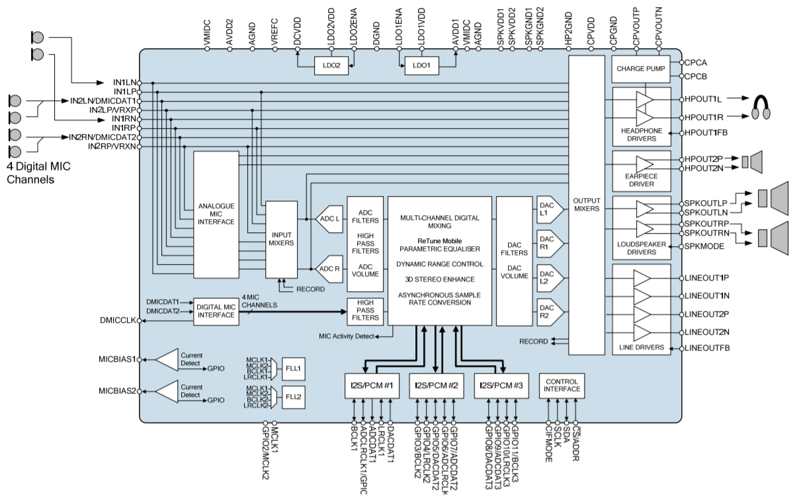

# Audio

Dans cette partie, nous verrons l'ajout de la bibliothèque pour l'utilisation du codec audio WM8994 ainsi que son utilisation.
La communication avec le codec se fera à l'aide de l'interface SAI.

## Documentation 

### Codec WM8994

Le codec WM8994 est un dispositif matériel permettant de mettre en oeuvre l'encode ou le décodage d'un flux de données numérique, en vue d'une transmission ou d'un stockage.

*I/O Codec WM8994*

[Lien doc WM8994](https://www.mouser.com/datasheet/2/76/WM8994_ProductBrief_2-217999.pdf)

### SAI

*Diagramme SAI*

[Lien doc SAI](https://www.st.com/resource/en/user_manual/dm00189702-description-of-stm32f7-hal-and-lowlayer-drivers-stmicroelectronics.pdf#page=861)

### DMA
[Lien doc DMA](https://www.st.com/content/ccc/resource/training/technical/product_training/group0/ce/9e/fe/44/e5/62/45/34/STM32F7_System_DMA/files/STM32F7_System_DMA.pdf/jcr:content/translations/en.STM32F7_System_DMA.pdf)
## Ajout de la bibliothèque

On active l'interface SAI dans Multimedia avec une liaison Maitre et une laison Esclave synchrone.

Les requêtes se font alors avec le DMA avec la configuration suivante

Une fois tout ceci fait, on peut rajouter les headers et fichiers sources dans notre projet.

## Fonctions principales