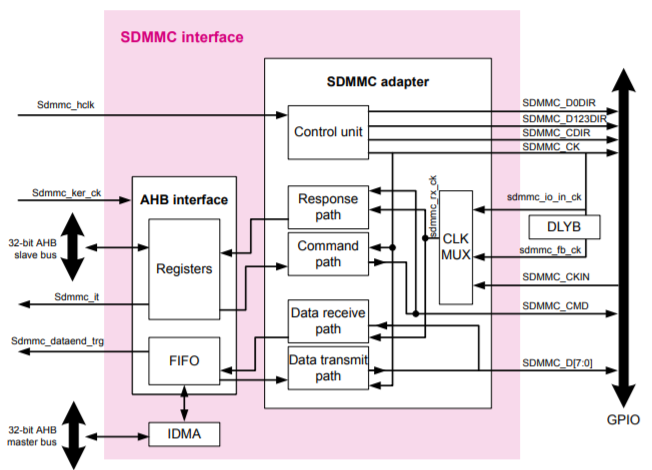
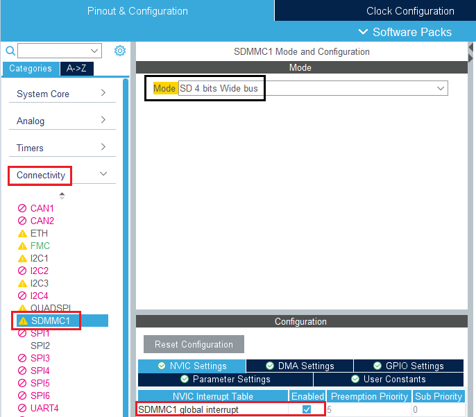
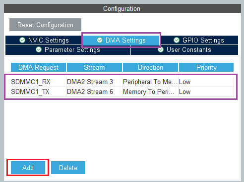
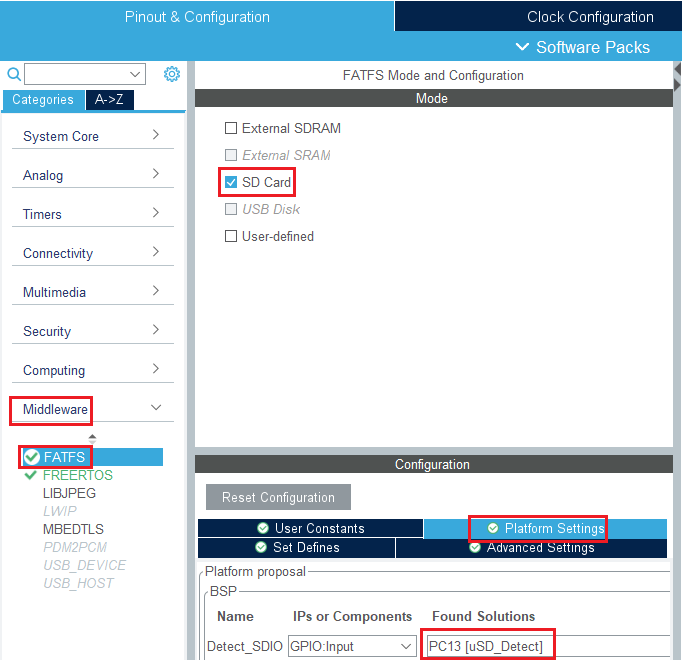
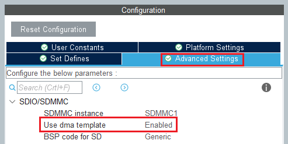
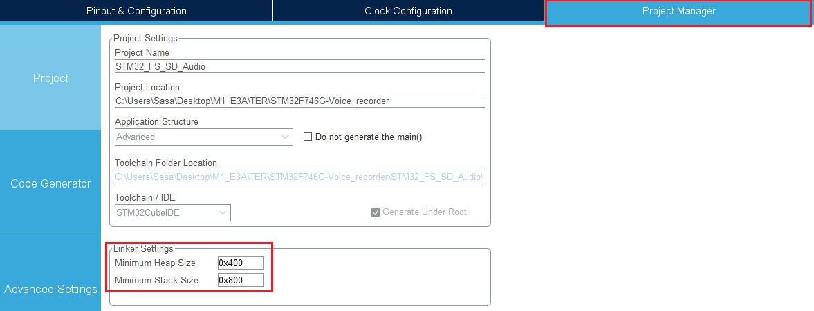

# Carte SD

Dans cette partie, nous verrons l'ajout de la bibliothèque pour l'utilisation de la carte SD ainsi que son utilisation.
La communication avec la carte SD se fera à l'aide de l'interface SDMMC ainsi que le DMA.

## Documentation

### SDMMC

Rapide, flexible, plus complexe et plus d'E/S

*Diagramme SDMMC*

[Lien doc SDMMC](https://www.st.com/content/ccc/resource/training/technical/product_training/group0/a7/61/d8/cf/a0/c8/4d/08/STM32F7_Peripheral_SDMMC/files/STM32F7_Peripheral_SDMMC.pdf/_jcr_content/translations/en.STM32F7_Peripheral_SDMMC.pdf)

### FatFs
[Lien doc FatFs](https://www.st.com/resource/en/user_manual/dm00105259-developing-applications-on-stm32cube-with-fatfs-stmicroelectronics.pdf)

## Ajout la bibliothèque SD

[Vidéo de démonstration](https://www.youtube.com/watch?v=I9KDN1o6924&t=474s&ab_channel=STMicroelectronics)

On se rend sur l'interface de configuration graphique de STM32CubeMX, puis on active le périphérique SDMMC1 dans Connectivity.

On ajoute la communication par DMA en gardant les paramètres par défaut.

Pour enfin ajouter le module FatFs

en activant le template DMA.

Enfin, on n'oubliera pas de changer la configuration du connecteur dans Project Manager.

## Fonctions principales

